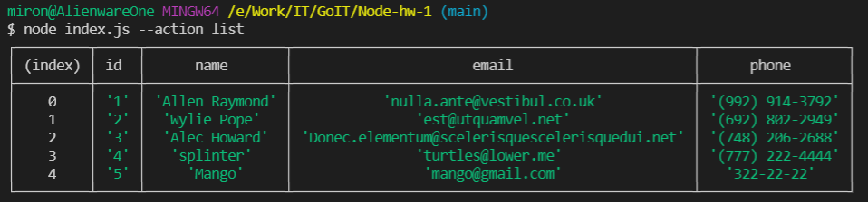
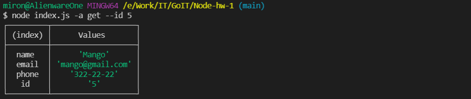
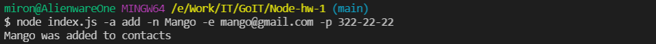
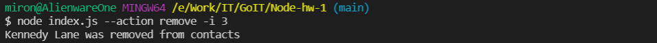

<h1 align="center">Contacts CLI</h1>

## Table of contents

- [Objective](#objective)
- [Technologies](#technologies)
- [API] (#api)
- [CLI] (#cli)
- [Examples](#examples)

## Objective

Create basic CLI to work with local database using
node.js.

## Technologies

Used packets and modules:

- Commander
- Nodemon
- Node.js fs
- Node.js path

## API

asynchronus functions:

- `listContacts()` - returns data from database.
- `getContactById(contactId)` - returns single item by provided `id` from database. If provided with non existent `id` returns `null`.
- `removeContact(contactId)` - removes single item from database by provided `id`. Returns removed item.
- `addContact(name, email, phone)` - creates new contact then adds it to database. Returns created contact.

additional functions:

- `getContactsPath()` - returns absolute path to `contacts.json`.
- `updateContacts(path, updater)` - writes provided `data` to file in `path`.
- `updateId(arr)` - updates ID's in provided `array`.

## CLI

use command `node index.js` with flag `--action` or shorthand `-a` plus action you want to perform:

- `list` - logs complete list of items from database
- `get --id <number>` - logs contact with provided id number.
- `add --name <name> --email <email> --phone <phone>` - logs and adds new contact to database.
- `remove --id <number>` - removes contact from database and logs it.

You can use shorthands:

- `--id` = `-i`
- `--name` = `-n`
- `--email` = `-e`
- `--phone` = `-p`

## Examples

```shell
$ node index.js --action list
```



```shell
$ node index.js -a get --id 5
```



```shell
$ node index.js -a add -n Mango -e mango@gmail.com -p 322-22-22
```



```shell
$ node index.js --action remove -i 3
```


